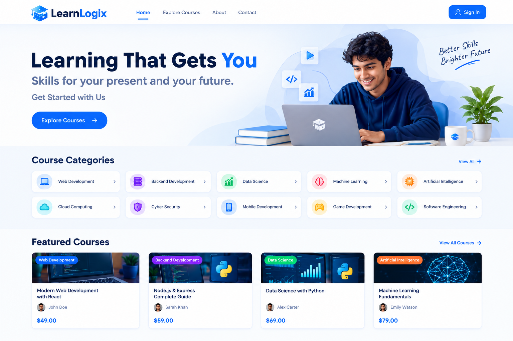
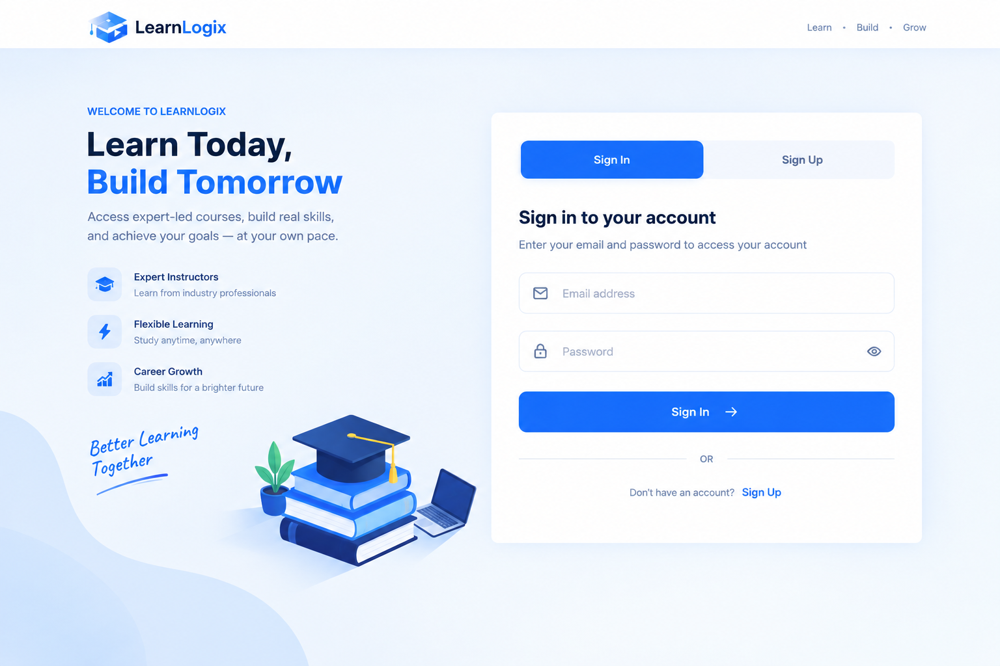
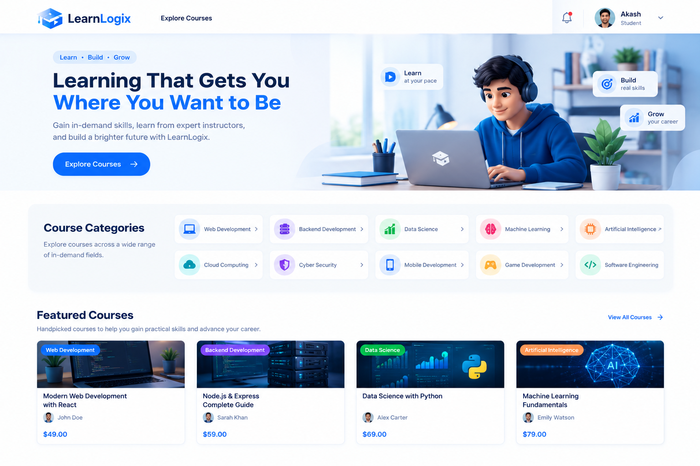
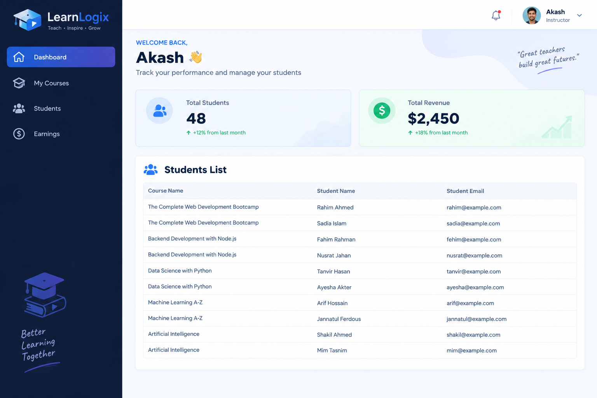
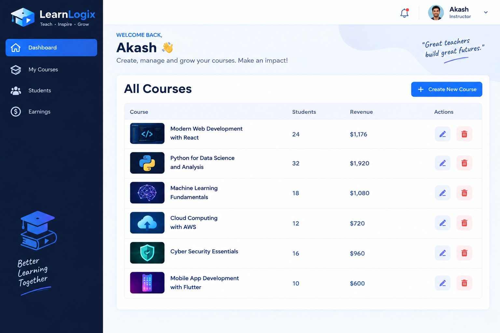
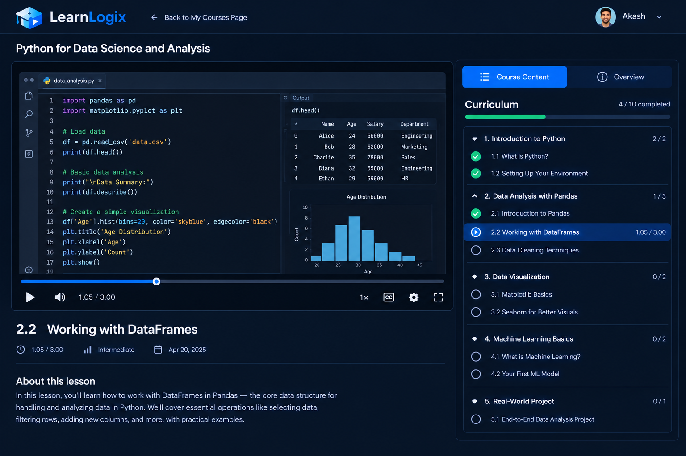

<p align="center">
  <picture>
    <!-- Dark mode logo -->
    <source media="(prefers-color-scheme: dark)" srcset="project-frontend/src/assets/dark.png" />
    <!-- Light mode logo -->
    <source media="(prefers-color-scheme: light)" srcset="project-frontend/src/assets/white.png" />
    <!-- Fallback -->
    
  </picture>
</p>

<p align="center">
  <a href="https://react.dev/">
    
  </a>
  <a href="https://tailwindcss.com/">
    
  </a>
  <a href="https://ui.shadcn.com/">
    
  </a>
  <a href="https://nodejs.org/">
    
  </a>
  <a href="https://expressjs.com/">
    
  </a>
  <a href="https://www.mongodb.com/">
    
  </a>
  <a href="https://www.paypal.com/">
    
  </a>
  <a href="LICENSE">
    
  </a>
</p>

# 🎓 LearnLogix — Learning Management System



**LearnLogix** is a modern **full-stack Learning Management System (LMS)** built to provide an interactive learning platform for students and a powerful course management system for instructors.

Students can explore courses without signing in, browse different course categories, view course details, purchase courses, access their enrolled courses, watch course videos, and track their learning progress.

Instructors have access to a dedicated dashboard where they can create and manage courses, add curriculum and course media, monitor enrolled students, and track course revenue.

LearnLogix is built using **React, TailwindCSS, shadcn/ui, Node.js, Express.js, MongoDB, and PayPal**, providing a complete end-to-end e-learning experience.

---

# 📸 Demo

## 🔐 Authentication



---

## 🏠 Student Home Page



---

## 👨‍🏫 Instructor Dashboard



---

## 📚 Instructor Course Management



---

## 🎥 Course Learning & Progress



---

# ✨ Features

## 👨‍🎓 Student Features

### 🏠 Course Discovery

Students can explore the platform before signing in.

- Browse available courses
- Explore course categories
- View featured courses
- View course titles
- View instructor information
- View course pricing
- View course details
- Filter courses by category

### 🔐 Authentication

Students can create an account and securely sign in.

- Student registration
- Student login
- Secure authentication
- Protected routes
- Session management
- Sign out functionality
- Role-based access

### 📚 My Courses

After signing in, students can manage their learning journey.

- View enrolled courses
- View currently learning courses
- View completed courses
- Access purchased courses
- Continue learning from previous progress
- View individual course progress

### 🎥 Course Learning

Students can access course lessons through a dedicated learning interface.

- Course curriculum
- Video lessons
- Course player
- Media progress bar
- Lesson completion tracking
- Video progress tracking
- Resume learning
- Overall course progress

### 📊 Learning Progress

LearnLogix tracks student progress throughout each course.

- Track individual video progress
- Track completed lessons
- Track overall course progress
- Resume from previous position
- Continue learning from the last watched lesson

---

## 👨‍🏫 Instructor Features

### 📊 Instructor Dashboard

Instructors have a dedicated dashboard to monitor their platform activity.

- View total students
- View total revenue
- View course performance
- View student information
- View course sales
- View course-specific revenue

### 📚 Course Management

Instructors can create and manage their courses.

- Create new courses
- Edit existing courses
- Delete courses
- Add course information
- Create course curriculum
- Add video lessons
- Upload course media
- Update course content
- Manage course structure

### 👥 Student Management

Instructors can monitor students enrolled in their courses.

- View total students
- View enrolled students
- View students associated with courses
- Monitor course enrollment

### 💰 Revenue Tracking

Instructors can monitor revenue generated from their courses.

- View total revenue
- View course revenue
- View course sales
- View number of enrolled students
- Track individual course performance

Course revenue can be calculated based on:

```text
Course Revenue = Course Price × Number of Enrolled Students
```
## 📖Course Learning Flow

The complete student learning process can be represented as:
```text
Student
   │
   ▼
Browse Courses
   │
   ▼
Select Course
   │
   ▼
View Course Details
   │
   ▼
Purchase Course
   │
   ▼
Enrollment
   │
   ▼
My Courses
   │
   ▼
Course Player
   │
   ▼
Watch Video
   │
   ▼
Track Progress
   │
   ▼
Complete Course
```

## 📈 Progress Tracking

Progress tracking is one of the core features of LearnLogix.

When a student watches a video, the platform tracks media progress and associates it with the student's course progress.
```text
Video Player
      │
      ▼
Media Progress
      │
      ▼
Progress Route
      │
      ▼
Progress Record
      │
      ▼
Course Progress
      │
      ▼
Student Dashboard
```
## 🛒 Enrollment & Order Processing

When a student purchases a course, the system processes the order and enrollment.

```text
Student
   │
   ▼
Course Details
   │
   ▼
Payment
   │
   ▼
Order Processing
   │
   ├──────────────► Order Record
   │
   └──────────────► Enrollment Record
                          │
                          ▼
                    Purchased Course
```

This allows LearnLogix to distinguish between:
- Available courses
- Purchased courses
- Enrolled courses
- Currently learning courses
- Completed courses

## 🏗️ System Architecture

LearnLogix follows a modular full-stack architecture that separates the student experience, instructor/course management, API services, learning progress, payment processing, and database services.

 🔄 High-Level Application Flow
```text
                         ┌──────────────────┐
                         │      Users       │
                         └────────┬─────────┘
                                  │
                    ┌─────────────┴─────────────┐
                    │                           │
              👨‍🎓 Student                 👨‍🏫 Instructor
                    │                           │
                    └─────────────┬─────────────┘
                                  │
                                  ▼
                         ┌──────────────────┐
                         │  React Frontend  │
                         └────────┬─────────┘
                                  │
                                  ▼
                         ┌──────────────────┐
                         │   API Routes     │
                         │  Express / Node  │
                         └────────┬─────────┘
                                  │
             ┌────────────────────┼────────────────────┐
             │                    │                    │
             ▼                    ▼                    ▼
      Course Management    Student Learning     Platform Services
             │                    │                    │
             │                    │                    ├── Authentication
             │                    │                    ├── Enrollment
             │                    │                    ├── Orders
             │                    │                    └── Payments
             │                    │
             └────────────────────┼────────────────────┘
                                  │
                                  ▼
                            ┌───────────┐
                            │  MongoDB  │
                            └───────────┘
```

# 🧩 Major System Components
## 👨‍🎓 Student Module

The student module handles the complete learning experience.
```text
Student
   │
   ├── Authentication
   │
   ├── Course Discovery
   │
   ├── Course Details
   │
   ├── Course Purchase
   │
   ├── Purchased Courses
   │
   ├── Course Player
   │
   └── Progress Tracking
```
## 👨‍🏫 Instructor Module

The instructor module focuses on course creation and management.
```text
Instructor
   │
   ├── Instructor Dashboard
   │
   ├── Course Management
   │
   ├── Course Creation
   │
   ├── Course Editing
   │
   ├── Course Curriculum
   │
   ├── Media Upload
   │
   ├── Student Monitoring
   │
   └── Revenue Tracking
```

## 🗄️ Database Architecture

MongoDB is used as the primary database for storing platform data.

The platform maintains records for the major entities of the system.
```text
MongoDB
   │
   ├── User Records
   │
   ├── Course Records
   │
   ├── Enrollment Records
   │
   ├── Progress Records
   │
   └── Order Records
```

## 👤 User Records

Stores user authentication and profile information.

## 📚 Course Records

Stores course information, pricing, curriculum, and course content.

## 🎓 Enrollment Records

Connects students with courses they have purchased or enrolled in.

## 📈 Progress Records

Stores student learning and video progress.

## 🧾 Order Records

Stores course purchase and payment-related information.

## 🔌 API Architecture

The backend is organized into modular API routes.
```text
API Services
│
├── Authentication Routes
│
├── Course Routes
│
├── Instructor Routes
│
├── Media Routes
│
├── Student Routes
│
├── Progress Routes
│
├── Enrollment Routes
│
├── Order Routes
│
└── Payment Routes\
```
This modular structure separates different responsibilities of the application and makes the backend easier to maintain and extend.

## 🔄 Request Flow

A typical request follows the architecture below:
```text
React Component
      │
      ▼
Service Function
      │
      ▼
API Route
      │
      ▼
Controller / Business Logic
      │
      ▼
MongoDB
      │
      ▼
API Response
      │
      ▼
React State
      │
      ▼
UI Update
```

for example, when an instructor creates a course:
```text
Create Course Form
        │
        ▼
Instructor Context
        │
        ▼
Course Service
        │
        ▼
Instructor API Route
        │
        ▼
Course Processing
        │
        ▼
MongoDB
        │
        ▼
Course Created
```

## 📂 Project Structure
```text
LearnLogix/
│
├── client/                         # React frontend
│   ├── src/
│   │   ├── components/             # Reusable UI components
│   │   ├── config/                 # Application configuration
│   │   ├── context/                # Auth, student & instructor state
│   │   ├── pages/                  # Application pages
│   │   ├── services/               # API service functions
│   │   └── ...
│   └── package.json
│
├── server/                         # Node.js / Express backend
│   ├── controllers/                # Business logic
│   ├── models/                     # MongoDB/Mongoose models
│   ├── routes/                     # API routes
│   ├── middleware/                 # Authentication & middleware
│   ├── helpers/                    # Utility functions
│   └── server.js
│
├── assets/                         # README screenshots and images
│   ├── learnlogix-logo.png
│   ├── learnlogix-auth.png
│   ├── learnlogix-home.png
│   ├── learnlogix-instructor-dashboard.png
│   ├── learnlogix-instructor-courses.png
│   ├── learnlogix-course-progress.png
│   └── learnlogix-architecture.png
│
├── .gitignore
├── .env                            # Environment variables
├── README.md
└── package.json
```
# 🛠️ Tech Stack

## Frontend

- **React** — Component-based frontend framework
- **React Router** — Client-side routing
- **TailwindCSS** — Utility-first styling
- **shadcn/ui** — Reusable UI components
- **Lucide React** — Icons
- **Context API** — Global application state
- **Axios** — HTTP requests

## Backend

- **Node.js**
- **Express.js**
- **REST API**
- **JWT Authentication**

## Database

- **MongoDB**
- **Mongoose**

## Payment

- **PayPal**

## Media

- Course video content
- Course thumbnails
- Media progress tracking
- Video progress management

---

# 🔐 Authentication & Authorization

LearnLogix uses authentication and role-based authorization to provide different experiences for students and instructors.

## 👨‍🎓 Student

Students can:

- Browse courses
- View course details
- Purchase courses
- Access enrolled courses
- Watch course content
- Track learning progress
- Manage their courses

## 👨‍🏫 Instructor

Instructors can:

- Access the instructor dashboard
- Create courses
- Edit courses
- Delete courses
- Manage course curriculum
- Upload course media
- View enrolled students
- Monitor course revenue

Protected routes prevent unauthorized users from accessing restricted functionality.

---

# 🚀 Getting Started

## 1. Clone the Repository

```bash
git clone https://github.com/your-username/LearnLogix.git
cd LearnLogix
```
## 2. Setup Backend

Navigate to the backend directory:

```bash
cd server
```
Install dependencies:
```bash
npm install
```
Create a .env file:
```bash
PORT=4000

MONGO_URI=mongodb://127.0.0.1:27017/learnlogix

JWT_SECRET=your-secret-key

CLIENT_URL=http://localhost:5173

PAYPAL_CLIENT_ID=your-paypal-client-id

PAYPAL_CLIENT_SECRET=your-paypal-client-secret
```
Start the backend:
```bash
npm run dev
```
## 3. Setup Frontend

Open another terminal:
```bash
cd client
```
Install dependencies:
```bash
npm install
```
Start the development server:
```bash
npm run dev
```
The application will normally be available at:
```bash
http://localhost:5173
```
📦 Scripts
Frontend
```bash
npm run dev
```
Start the Vite development server.
```bash
npm run build
```
Build the application for production.
```bash
npm run preview
```     
Preview the production build.

Backend
```bash
npm run dev
```
Start the backend development server.
```bash
npm start
```
Start the backend normally.

## 🔐 Environment Variables

The following environment variables are required:
```bash
PORT=4000

MONGO_URI=your-mongodb-connection-string

JWT_SECRET=your-jwt-secret

CLIENT_URL=http://localhost:5173

PAYPAL_CLIENT_ID=your-paypal-client-id

PAYPAL_CLIENT_SECRET=your-paypal-client-secret

Important: Never commit your .env file or expose your secret keys publicly.

```
# 📱 Responsive Design

LearnLogix is designed to provide a consistent and accessible experience across different screen sizes and devices.

The application supports:

- 💻 Desktop
- 💻 Laptop
- 📱 Tablet
- 📱 Mobile

TailwindCSS responsive utilities are used throughout the application to create an adaptable and responsive user interface.

---

# 🎯 Project Goals

LearnLogix was developed with the following goals:

- Provide a modern online learning experience
- Make course discovery simple and accessible
- Allow students to track their learning progress
- Provide video-based learning
- Allow students to manage their enrolled courses
- Allow students to continue learning from their previous progress
- Give instructors complete control over course content
- Allow instructors to create and manage courses
- Provide instructors with student enrollment information
- Provide instructors with course revenue information
- Integrate online course payments
- Build a scalable full-stack LMS architecture
- Maintain a clean and responsive user interface
- Provide separate experiences for students and instructors

---

# 🔮 Future Enhancements

Some planned improvements include:

- ⭐ Course reviews and ratings
- 💬 Student-instructor communication
- 🔔 Notifications
- 📜 Course completion certificates
- 🏆 Student achievements and badges
- 📈 Advanced instructor analytics
- 📊 Detailed student learning analytics
- ❤️ Wishlist functionality
- 🔎 Advanced course search
- 🎯 Personalized course recommendations
- 📝 Quizzes and assessments
- 📋 Assignments
- 📧 Email notifications
- 🌐 Multiple language support
- 📱 Dedicated mobile application
- 🎓 Instructor verification
- 📚 Course prerequisites
- 🏅 Student certificates and achievements

---
## 🙋‍♂️ Author

MD Sifat Ahammed Akash

📫 Email: sifatahammed821@gmail.com

## 📄 License
<div align="center">

MIT License © MD Sifat Ahammed Akash

 </div> ```


